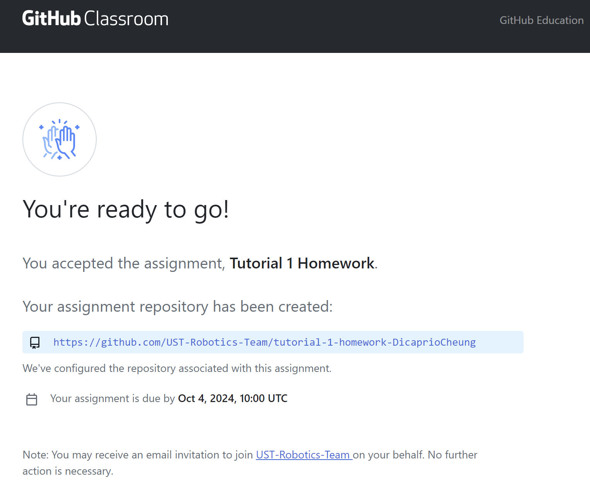
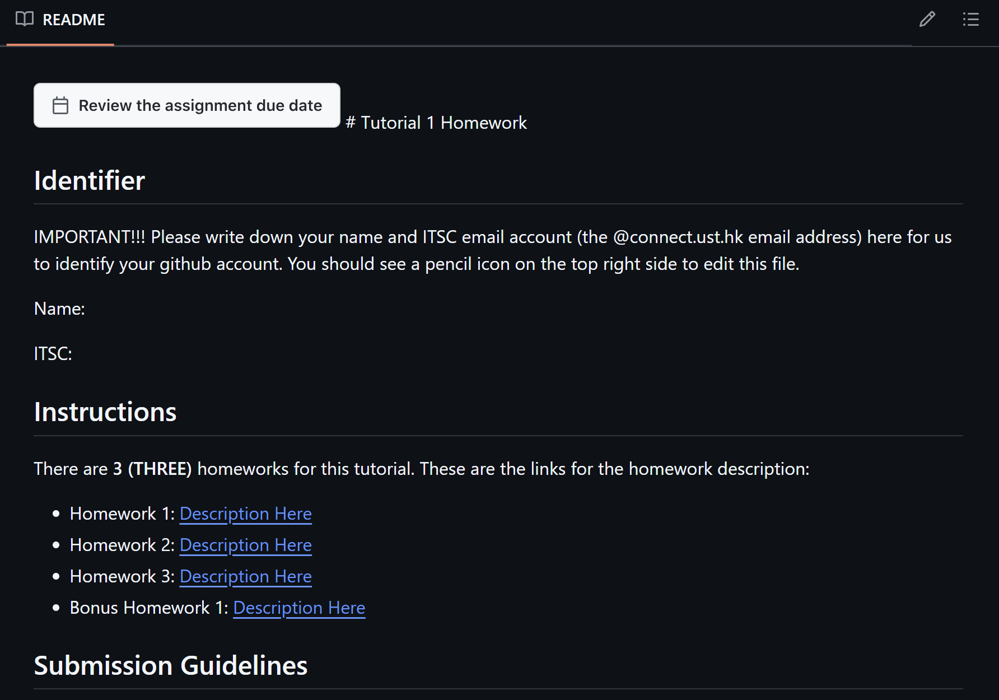

[Back to Tutorial 0 Main Page](../tutorial-0-self-learn-basic-c/README.md) 

# Tutorial 1: Basic C

> Tutorial 1: Let's officially begin!

### Tutorial 1

- Content: More Basics of C
- Classworks: 5 Classworks
- Homeworks: 3 Homeworks + 1 Bonus Homeworks
- Homework Deadline: 4 Oct 2024 (Fri) 18:00

|Session|S01|S02|S03|
|---|---|---|---|
|Time|23 Sep(Mon) 19:00~22:00|25 Oct(Wed) 19:00~22:00|26 Oct(Thur) 19:00~22:00|
|Venue|Room 6580 (Lift 27/28)|Room 4582 (Lift 27/28)|Room 6580 (Lift 27/28)|

### Tutorial 1 Targets

* Understand more concepts on C Programming and be able to implement more complicated logics
* Learn more about conventions and best practices in programming

## Tutorial 1 Review (Back to Tutorial 0 Links)

First of all, we will make sure that you can flash code into our board using STM32CubeIDE:

Please review the CubeIDE installation method on

* [02) Where to Write Code](../tutorial-0-self-learn-basic-c/02-where-to-write-code.md) 

We will start reviewing variables and operator, then emphasizing control flow

* [04) Variables and Input-Output](../tutorial-0-self-learn-basic-c/04-variable-io.md)
* [05) Operators](../tutorial-0-self-learn-basic-c/05-operators.md)
* [07) Control Flow](../tutorial-0-self-learn-basic-c/07-control-flow.md)

## Tutorial 1 Materials

Materials to Introduce in Tutorial 1:

> Concepts that are less important but are still worth a quick read before moving on to the next part are marked with `*`

* [08) Array and String](08-array-string.md)
  * [Arrays](08-array-string.md#arrays)
  * [Strings (array of `char`)](08-array-string.md#string-character-array)
  * [`string.h` library*](08-array-string.md#the-stringh-library)
  * [Self Tests](08-array-string.md#self-test)
* [09) Functions](09-functions.md) 
  * [Function Definition and Calls](09-functions.md#function-definition-and-call)
  * [Passing Arrays](09-functions.md#pass-an-array-to-a-function)
  * [How to Modify Non-Array Variables*](09-functions.md#how-to-modify-non-array-variables-in-functions)
  * [Function Declaration*](09-functions.md#function-declaration)
  * [Self Tests](09-functions.md#self-tests)
* [10) Structs and Enums](10-struct.md)
  * [Structs](10-struct.md#struct)
  * [Typedef](10-struct.md#typedef)
  * [Enums](10-struct.md#enum)
  * [Self Tests](10-struct.md#self-test)
* [11) Multi File Programming](11-multi-file-programming.md) (This part is important to understand how workspaces with multiple files works, which is common in robot programming)
  * [File Types](11-multi-file-programming.md#file-types)
  * [How to do Multi File Programming](11-multi-file-programming.md#multi-file-programming-1)
  * [Separate Compilation](11-multi-file-programming.md#separate-compilation)

We will discuss a bit of this material if we have time:

* [12) Recursion*](12-recursion.md)
  * [Self-Tests](12-recursion.md#self-test) 

# Advanced C

Other than those, there are a few more features that we wish you can explore by yourself further...

* [A1) Preprocessors](a1-preprocessor.md)
* [A2) Static and Extern](a2-static-extern.md)
* [A3) Union](a3-union.md)
* [A4) Pointers](a4-pointers.md)

## Classworks

We will have 5 classworks to check your understanding on the materials. They will be linked to after we have finished discussing sufficient material on the topic of the classwork.

However, for a quick link to all of them:

* [Classwork 1: Matrix Addition -- Arrays](classwork/classwork-1-matrix-addition.md)
* [Classwork 2: First Word -- String](classwork/classwork-2-first-word.md)
* [Classwork 3: Area of a Circle -- Functions](classwork/classwork-3-area-of-circle.md)
* [Classwork 4: Greyscale Image -- Struct](classwork/classwork-4-greyscale-image.md)
* [Classwork 5: Mean Median Min Max -- Separate Compilation](classwork/classwork-5-mean-median-min-max/README.md)

## Homeworks

Please submit these homeworks before 4 Oct 2024 (Fri) 18:00

* [01) Number System Converter](homeworks/hw01-number-system-converter/README.md)
* [02) Letter Chess](homeworks/hw02-letter-chess/README.md)
* [03) Sand Tetris](homeworks/hw03-sand-tetris/README.md)

#### Bonus

It is a bonus. So, it is optional to do.

* [B1) Score Attack](homeworks/hwB1-score-attack/README.md)
  
Submission Method: `Github Classroom`
Please first accept the assignment on Github Classroom: [https://classroom.github.com/a/P863CrLD](https://classroom.github.com/a/P863CrLD) and the click the link to your working repository. Details of the submission will later be given there (note that the picture below is just for your reference, it is not your workspace link and the due date is wrong).

You can see the submission guidelines on the README shown below the file list. (i know the format below is broken but i decided to ignore it)

 

[To Tutorial 2 Main Page](../tutorial-2-basic-io/README.md) 
