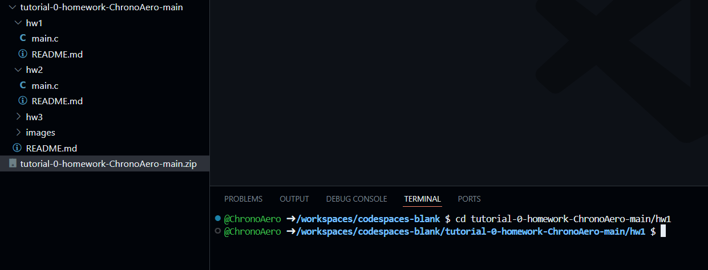

[Back to Main](../../README.md)


# Advanced Task 1 : Score attack

> A traditional challenge that no one can solve

<details>

<summary>Authors</summary>

Dicaprio Cheung

Li Ka Yau Elwin

Wong Lok Yin Leo

Tsang Hong Ting Dennis

</details>

## Problem

Let's say a string is given to you containing only A's, B's, and C's, e.g. AACCBBCCCAAA. The objective is to eliminate all letters. Each turn, you can eliminate any consecutive letters that have the same value. For example, we can eliminate A, BB, and CCC; but not AC, BBC, and CAA.

One mark will be given for each letter eliminated. For example, if we eliminated BB in the above example, 2 marks will be given.

In addition, you can get a combo score by eliminating 5 or more letters at a time, determined by a **combo multiplier**. For instance, after eliminating BB, the remaining string will become AACCCCCAAA. If we eliminate CCCCC, 5×1.5=7.5 marks will be given. The combo multiplier table is shown below:


| Letters Eliminated | Combo Multiplier |
| ------------------ | ---------------- |
| 5                  | 1.5              |
| 6                  | 1.6              |
| 7                  | 1.7              |
| 8                  | 1.8              |
| 9                  | 1.9              |
| 10                 | 2.0              |
| 11                 | 2.1              |
| 12                 | 2.2              |
| 13                 | 2.3              |
| 14                 | 2.4              |
| 15                 | 2.5              |
| 16                 | 2.6              |
| 17                 | 2.7              |
| 18                 | 2.8              |
| 19                 | 2.9              |
| 20                 | 3.0              |
| 21                 | 3.1              |
| 22                 | 3.2              |
| 23                 | 3.3              |
| 24                 | 3.4              |
| 25                 | 3.5              |
| 26                 | 3.6              |
| 27                 | 3.7              |
| 28                 | 3.8              |
| 29                 | 3.9              |
| 30+                | 4.0              |

If the eliminated length is greater than 30, the combo multiplier will still be 4.0.

## Part 1

Your task is to write a program to find the maximum score obtainable by eliminating letters in the above fashion.

#### Example

```
Show intermediate steps? (y or n):
n
Please enter a string:
ACBACBABBABAACABAAABCB
Maximum Score:
32
```

#### Assumptions for this part

* The input for "show intermediate steps" accepts both lowercase and uppercase letter.
* The input string only has 'A', 'B', 'C', and nothing else.
* The maximum length of the input string is 300.

> Note: There is a 5 seconds timeout. So, your code must finish running within 5 seconds

## Part 2

Apart from finding the maximum score, please also output the steps of eliminating the letters.

#### Example

```
Show intermediate steps? (y or n):
y
Please enter a string:
CBCCCBBBCAAAAAAAABBCBCBBBC
CCCCBBBCAAAAAAAABBCBCBBBC +1 B
CCCCBBBAAAAAAAABBCBCBBBC +1 C
CCCCBBBBBCBCBBBC +8x1.8 AAAAAAAA
CCCCBBBBBBCBBBC +1 C
CCCCBBBBBBBBBC +1 C
CCCCC +9x1.9 BBBBBBBBB
+5x1.5 CCCCC
Maximum Score:
43
```

#### Assumptions

* The input for show intermediate steps accept both lowercase and uppercase letter.
* ~~Some assumption is gone~~
* The maximum length of the input string is 300.
* When you have multiple choices to eliminate the letters, you should eliminate the string in the front first.
* The output format of the steps is:

```
<remaining string>' '    << if there is remaining string
'+'<number of eliminated letters>
'x'<combo multiplier>    << if there is combo multiplier
' '<eliminated string>
<next line>
```

> Note: There is a 5 seconds timeout. So, your code must finish running within 5 seconds


## How to Run Your Code

To run the code, you need to make sure that you are first in the right folder/directory in your terminal (the text area under your code):
Currently, in the example, the user is in the directory `/workspaces/codespaces-blank` you need to get to `/workspaces/codespaces-blank/<homework-repository-name>/hwb1` to run your `main.c` code, do this by writing the command `cd <homework-repository-name>/hwb1` (cd: change directory) and press enter.

(Note: if you want to go up a folder you can use `cd ..`)




Note that you need to do this everytime you open the Github Codespace.

Once you are in the direcctory, run the following command in the terminal:
```
gcc -o homework.exe main.c && ./homework.exe 
``` 


## Submission
Modify your `main.c` file. We still use Github Classroom to grade your submissions, the instruction is still similar to the one in Tutorial 0 README.md.
