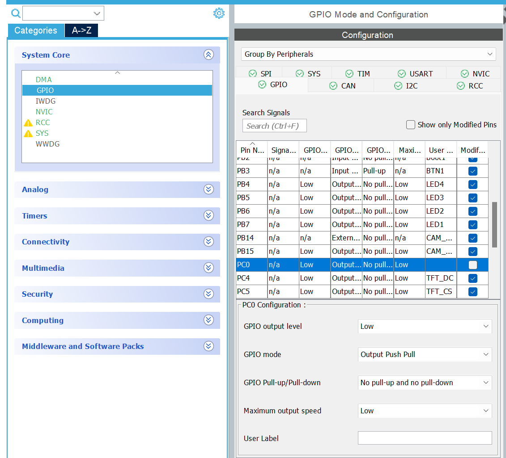

[Back to Main](README.md) | [Previous Page](04-TFT.md)

# Basic STM32 Configuration

Throughout your RDC journey, you will not need to configure all pinouts and function modules from scratch due to the many technical considerations involved. We have already provided you with a mostly completed configuration file called "SW Tutorial," which includes commonly used functionalities such as CAN, LED, TFT, and PWM.
However, you may still need to utilize some GPIO pins, and we cannot predict what and where you will connect to the board. Therefore, we will introduce some basic skills for setting up GPIO pins.

### Project Structure
In the project, you will commonly see a folder structure like this:

**Key Points:**
- The `includes` folder contains fundamental libraries that you should not modify. User-written headers should be stored in `/Core/Inc`.
- The `sw-tutorial.ioc` file opens the CubeMX GUI, a tool that allows you to configure different pinouts.
- Note that changes made in the configuration file will not take effect immediately. You must click "Generate Code" in CubeMX to apply the configuration.
### Configuration & Pinout Page
When you click the `.ioc` file, you will enter an interface similar to this:


- The leftmost panel is the **Module Panel**, where you can select all the available subsystems for the selected chip.
- The second panel from the left is the **Configuration Panel**, where you can access and set up detailed configurations.
- The main panel on the right is the **Pinout Panel**, where you can choose the purpose of each pin

### How to Configure a GPIO Pin
1. **Select the Pin**: Find the correct pin you want to connect, such as `PC0`, based on the hardware schematic.
2. **Assign Functionality**: Click on the pin and select the appropriate system/application you want to link it to:
   
3. **Configure the Pin**: Open the corresponding system module (in this case, `GPIO`) and locate the pin you just set up:
   
    - Inside this configuration window, you can choose different settings for the GPIO pin. Ideally, you should not need to change anything from the default configuration for a `GPIO Output` pin. 
    - You can (and should) also rename the pin with a meaningful name. As mentioned in `02-GPIO.md`, CubeMX will generate the appropriate macro based on the name you enter, so you should rename it here instead of manually writing a macro.
4. **Save your configuration and Generate Code**: As mentioned, you need to save and generate code before you can make your change effective. In CubeMX under CubeIDE, you just need to save your change by click `Ctrl + S` ~~(mac ppl help yourself)~~ and click **YES** in the following Pop-up Windows.


Once configured, you can call the GPIO Pin using the macros we defined earlier and control your Air Cylinder.

---

### Extended Reading: GPIO Input Mode
- As we have mentioned, our GPIO only receive discrete 0/1 signal, so it is trivial enough when we have a GND / 3.3V(out TTL is set to be 3.3V) given to the port, but what if it is not connecting to anything?
- When it is not connected to anything, it is the case we say it is float, and it will lead to a unpredictable readings due to noise.
- Following Schematics provide you example of connection to nothing:

    <figure><figcaption></figcaption></figure>
    
    - When the button is pressed, the `BUT1` pin connected to `GND` , which refer to 0.
    - How about when the button is released?
        - Noise will cause you to read a mostly random value
    - Therefore we want to have some mechanism to make it to be a `1` or `3.3V` when the button is released, in the other words, and that is `PULL-UP`  in this case.
- The pull-up or pull-down gives a "**weak**" connection from the pin to either a high or low voltage. It gives a defined value to a floating pin while being weak enough to be easily overridden by any external signal.

#### Pull Up and Pull Down

<figure><figcaption></figcaption></figure>

<figure><figcaption></figcaption></figure>

When you choose `Pull Up`  or `Pull Down` in the configuration, the MCU will connect the input to the `Vcc`  / `GND`  by itself and  reduced the need for additional hardware components on the PCB.

⭐Other than `Pull Up` or `Pull Down` , you may also choose the `No Pull`  for Input Mode if your PCB have already drawn to connect both 3V3 and GND by default.

### Extended Reading: GPIO Output Mode

- Similar to Input, we have two mode of output in GPIO, namely **Push-pull** and **Open-drain**
    - **Push-pull(PP)** uses the 2 switches to connect the pin to either high voltage or low voltage, it pushes or pulls the voltage to the level assigned
    - **Open-drain(OD)** is similar but does not use the upper switch, thus it outputs a low voltage or completely disconnects the pin
- Inside the MCU lives a pair of switches, ie.`transistors`:
    
    <figure><figcaption></figcaption></figure>

### Side Tracker: GPIO Configuration    
Below we extract one GPIO `_Init` segment for you to see what is taking place during GPIO INIT, but you does not required to understand what is happening behind

```c
void MX_GPIO_Init(void)
{

  GPIO_InitTypeDef GPIO_InitStruct = {0};

  /* GPIO Ports Clock Enable */
  __HAL_RCC_GPIOB_CLK_ENABLE();

  /*Configure GPIO pin Output Level */
  HAL_GPIO_WritePin(GPIOB, TFT_BL_Pin|CAM_WEN_Pin|CAM_RCLK_Pin|LED4_Pin
                          |LED3_Pin|LED2_Pin|LED1_Pin, GPIO_PIN_RESET);                        

  /*Configure GPIO pin : PtPin */
  GPIO_InitStruct.Pin = BTN1_Pin;
  GPIO_InitStruct.Mode = GPIO_MODE_INPUT;
  GPIO_InitStruct.Pull = GPIO_PULLUP;
  HAL_GPIO_Init(BTN1_GPIO_Port, &GPIO_InitStruct);

  /* EXTI interrupt init*/
  HAL_NVIC_SetPriority(EXTI15_10_IRQn, 0, 0);
  HAL_NVIC_EnableIRQ(EXTI15_10_IRQn);
}
```